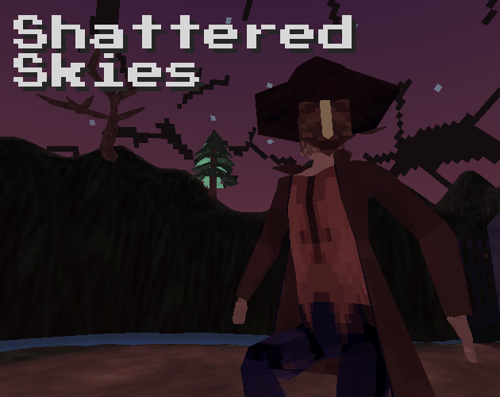

# Shattered Skies

"The sky, frozen over, crashing down to the earth. Isn't it lovely?" 

Use a huge greatsword to slash your way through a deserted riverside village, in pursuit of a mysterious masked man. 

    

This was my submission to "[Brackey's Game Jam 2021.2](https://itch.io/jam/brackeys-6)", a 7 day game jam.

You can download the game for free [here, on itch.io](https://request.itch.io/shattered-skies), 
or you can check out my other projects at [request.moe](https://request.moe).

You're free to do whatever with this code, but if you do use it, it'd be real cool of you to link back to this page or the itch.io page (or both). Thanks!

## Setup

  1. Clone this repo
  2. Install the [SteamVR Plugin](https://assetstore.unity.com/packages/tools/integration/steamvr-plugin-32647), as well as [Hurricane VR](https://assetstore.unity.com/packages/tools/physics/hurricane-vr-physics-interaction-toolkit-177300)

## Some topics of interest in this repo

### Swords with weight, and stamina in VR

In this game, you wield a very large sword to fight enemies. You also have a limited stamina pool, which depletes and regenerates quickly.
The more you move your sword around, the faster your stamina depletes. The lower your stamina, the harder it is to move your sword around.

This resource management makes for an interesting game loop - do I sprint up and attack the lizard enemy while its back is turned, or do I wait for it to come closer so I can attack with more stamina?
It's much harder to block projectiles when you can't lift your sword properly, so how much should the player prioritize defense over raw offense?

The way that this was implemented was by adjusting the mass of the rigidbody each frame depending on the percentage of stamina the player had available. 
Stamina loss from the sword was calculated based on per-frame velocity, measured at the tip of the sword. 

The weight range of the sword was configured such that the player could wield the sword single-handedly at full stamina, but could barely pick it up at low stamina.
An unexpected bonus of tweaking the mass of the rigidbody (rather than tweaking the strength of the hand's config joint) was that it prevented the player from abusing the strength of the physics hand, and simply lifting the sword without actually grabbing it.

### Final Boss Battle

Each enemy's logic was done in Finite State Machines, which are a topic that I've done before in other projects. This one features them in a larger scale - specifically for the final boss. 

The final boss had 3 attacks (summon a portal and rain sky shards on the player, shoot projectiles at the player, and a charge attack), each written up as a different state. The boss also had a main state that would multiplex between these attacks. 

The boss has a timer that must elapse before picking its next attack. If that timer hasn't elapsed yet, the boss will just warp around at random until he's ready to attack. Since the charge attack was the main attack that left him vulnerable, this attack was guaranteed to occur every few times. Otherwise, it was pretty much 50/50 between the other two attacks.

Another thing worth mentioning is that the rain attack can continue playing while the boss performs other attacks. This was done with a simple coroutine, that would play out over a pre-determined amount of time.

Finally, the boss gets harder over time, as his health depletes. Most attacks had a range of settings (attack duration, idle duration) that would change as the enemy's health approached zero.

### Dialog Management

This is something that I've also done in other projects, but I've refactored a bit more for this project.

  - Each piece of dialog, and each dialog speaker, is now defined in a scriptable object
  - Each dialog speaker has their own default "character typed" SFX, which can be overridden on a per-sentence level
  - There is now a customizable pitch range for SFX, which makes dialog sounds a lot less monotonous
  - There is now a customizable delay between typing characters of a sentence, which allows for sentences with more weight

This all made writing dialog much more fluid, and less prone to getting accidentally deleted by accident.

## Next Steps

### Animations in Dialog

Tying dialog sentences to animations is something that I had implemented for "[A VR Game About Ducks in Capitalism](https://request.itch.io/a-vr-game-about-ducks-in-capitalism)", but that solution needed refactoring. 

I think next time, I'll define a set of animations that can play in dialog as part of the Dialog Speaker's scriptable object definition, which can be triggered as part of a Dialog Sentence. On each sentence, a scriptable object event channel could send out events at the start of each Dialog Sentence, which could be picked up by some component on each actor's gameobject. A bit complex, but this way I wouldn't need to directly tie dialog, or dialog managers, to specific Animator components in my scene.

### Enemy AI: Reacting to damage

Currently, enemies don't change state upon taking damage. This is something I programmed in (ie: change to an attack state when recieving damage if we're in an idle/patrol state), but enemies would often not know where the player was when entering the state.

This is easily solvable, but it's just another thing to program that I didn't have time for in 7 days.

### Randomly drop sky shards

All of the sky shards are scripted events that start when the player enters a nearby trigger. I originally wanted them to spawn all over the world at random, dealing fatal damage to anything it collides with. This was just something I didn't have time to work on.

### Gameplay Tweaks

  * After recording footage, I realized that it would be more interesting if enemies could see through the metal spikes of the fences. Currently, it's all done as one big collider that enemies can't see through - but this change would force the player to duck out of sight, to avoid enemies. This would be especially interesting during the first and last areas.
  * The final boss' shoot attack is pretty easy to dodge if you're paying attention, because it all fires in a straight line at the player's head. If I had more time, I'd add a random initial rotation offset, so that each projectile would arc in a unique angle.
  * The lizard enemy's animation could use some tweaking. It feels pretty rigid at times
  * The crystal enemy's shooting patterns could stand to be more interesting. They could also use more VFX, since they're just shooting textured cubes at the player right now.

## Project Settings 

- Unity 2019.4.24f1
- Universal Render Pipeline (7.5.3)
- OpenVR Desktop (2.0.5)
- SteamVR (2.7.3, sdk 1.14.15)
- TextMesh Pro (2.1.4)
- Visual Effect Graph (7.5.3)
- Hurricane VR (2.1)

## Third Party Credits

Assets

Asset Type|Asset|Author|License	
-|-|-|-
Math Library|[MathFS](https://github.com/FreyaHolmer/Mathfs)|[Freya Holmér](https://twitter.com/FreyaHolmer)|[MIT License](https://github.com/FreyaHolmer/Mathfs/blob/master/LICENSE.txt)
Font|[Press Start 2P Font](https://www.fontspace.com/press-start-2p-font-f11591)|[codeman38]()|[SIL Open Font License (OFL)](https://www.fontspace.com/help#license-17)
BGM|[The Crypt](https://opengameart.org/content/the-crypt)|[GameMonk](https://opengameart.org/users/gamemonk)|[CC-BY-SA 3.0](https://creativecommons.org/licenses/by-sa/3.0/)
BGM|[Rin’s Theme](https://opengameart.org/content/rins-theme-loopable-chiptune-adventurebattle-bgm)|[Request](https://twitter.com/requestmoe)|[CC0 1.0 Universal](https://creativecommons.org/publicdomain/zero/1.0/)
Shader|[Skybox Gradient Shader](https://youtu.be/f6zUot73-gg)|[Alex Strook](https://twitter.com/AlexStrook)|
Textures|[UI Pack: RPG Expansion](https://www.kenney.nl/assets/ui-pack-rpg-expansion)|[Kenney](https://twitter.com/KenneyNL)|[CC0 1.0 Universal](https://creativecommons.org/publicdomain/zero/1.0/)
Textures|[Game Icons](https://kenney.nl/assets/game-icons)|[Kenney](https://twitter.com/KenneyNL)|[CC0 1.0 Universal](https://creativecommons.org/publicdomain/zero/1.0/)
Textures|[UI Pack: Space Expansion](https://kenney.nl/assets/ui-pack-space-expansion)|[Kenney](https://twitter.com/KenneyNL)|[CC0 1.0 Universal](https://creativecommons.org/publicdomain/zero/1.0/)

Unity Assets

Asset|Author
-|-
[SteamVR Plugin](https://assetstore.unity.com/packages/tools/integration/steamvr-plugin-32647)|Valve
[HurricaneVR](https://assetstore.unity.com/packages/tools/physics/hurricane-vr-physics-interaction-toolkit-177300)|[Cloudwalkin Games](https://twitter.com/HurricaneVr)
